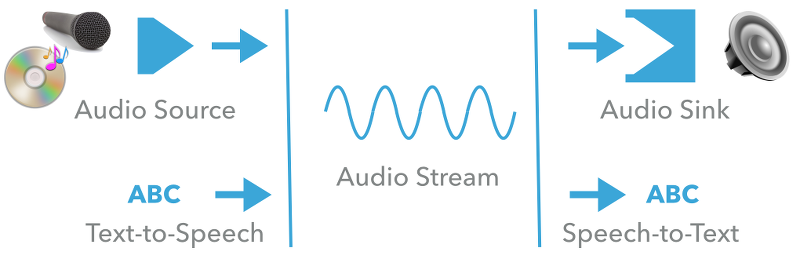



# Audio & Voice

Audio and voice features are an important aspect of any smart home solution as it is a very natural way to interact with the user.

Eclipse SmartHome comes with a very modular architecture that enables all kinds of different use cases. 
At its core, there is the notion of an *audio stream*. 
Audio streams are provided by *audio sources* and consumed by *audio sinks*.  

- *Audio Streams* are essentially a byte stream with a given *audio format*. 
They do not need to be limited in size, i.e. it is also allowed to have continuous streams, e.g. the input from a microphone or from an Internet radio station.
- *Audio Formats* define the container (e.g. WAV), encoding, bit rate, sample frequency and depth and the bit order (little or big endian).
- *Audio Sources* are services that are capable of producing audio streams. 
They can support different formats and provide a stream in a requested format upon request. 
Typical audio source services are microphones. Typically, a continuous stream is expected from them.
- *Audio Sinks* are services that accept audio streams of certain formats. 
Typically, these are expected to play the audio stream, i.e. they are some kind of speaker or media device.
- *Text-to-Speech* (TTS) services are similar to audio sources with respect to the ability to create audio streams. 
The difference is that they take a string as an input and will synthesize this string to a spoken text using a given voice. 
TTS services can provide information about the voices that they support and the locale that those voices are associated with. 
Each voice supports exactly one locale.
- *Speech-to-Text* (STT) services are similar to audio sinks, but they do not simply play back the stream, but convert it to a plain string. 
They provide information about supported formats and locales.

As plain text from an STT service is often not very useful, there is additionally the concept of a *human language interpreter*:

A *Human Language Interpreter* takes a string as an input. 
It then derives actions from it (like sending commands to devices) and/or replies with a string, which opens the possibility to realize conversations. 
As such an interpreter is not directly linked to audio streams, but operates on strings only, this can be the basis for any kind of assistant, e.g. for chat bots using the console, XMPP, Twitter or other messaging services. 

Applications can dynamically choose which services to use, so that different sinks can be used for different use cases. 
Defaults can be set as a configuration for all those services in case an application does not ask for any specific service.
