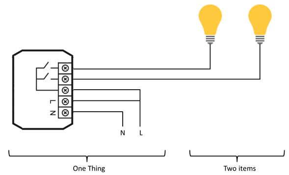



# Concepts

When first thinking about your home automation system, it may be helpful to bear in mind that there are two ways of thinking about or viewing your system; the physical view and the functional view.

The physical view will be familiar to you.
This view focuses on the devices in your system, the connections between these devices (e.g. wires, Z-Wave, WiFi hardware), and other physical aspects of the system.

The functional view might be a new concept for you.
The functional view focuses on how information about the devices, connections, and so on, is represented in user interfaces.
The functional view includes focusing on how rules affect representations of physical devices in software.
 Perhaps most important to you, the functional view focuses on how an action in a user interface affects the software associated with the physical device it represents.

It is a bit of an over-simplification, but you can think of the physical view as being a view of the 'real world', and the functional view being a view of the 'software world'.

## Things, Channels, Bindings, Items and Links

**Things** are entities that can be physically added to a system.
Things may provide more than one function (for example, a Z-Wave multi-sensor may provide a motion detector and also measure room temperature).
Things do not have to be physical devices; they can also represent a web service or any other manageable source of information and functionality.

Things expose their capabilities through **Channels**.
Whether an installation takes advantage of a particular capability reflected by a Channel depends on whether it has been configured to do so.
When you configure your system, you do not necessarily have to use every capability offered by a Thing.
You can find out what Channels are available for a Thing by looking at the documentation of the Thing's Binding.

**Bindings** can be thought of as software adapters, making Things available to your home automation system.
They are add-ons that provide a way to link Items to physical devices.
They also abstract away the specific communications requirements of that device so that it may be treated more generically by the framework.

**Items** represent capabilities that can be used by applications, either in user interfaces or in automation logic.
Items have a **State** and they may receive commands.

The glue between Things and Items are **Links**.
A Link is an association between exactly one Channel and one Item.
If a Channel is linked to an Item, it is "enabled", which means that the capability the Item represents is accessible through that Channel.
Channels may be linked to multiple Items and Items may be linked to multiple Channels.

To illustrate these concepts, consider the example below of a two-channel actuator that controls two lights:

The actuator is a Thing that might be installed in an electrical cabinet.
It has a physical address and it must be configured in order to be used (remember the physical view introduced at the beginning of this article).

In order for the user to control the two lights, he or she access the capability of the actuator Thing (turning on and off two separate lights) through two Channels, that are Linked to two switch Items presented to the user through a user interface.
