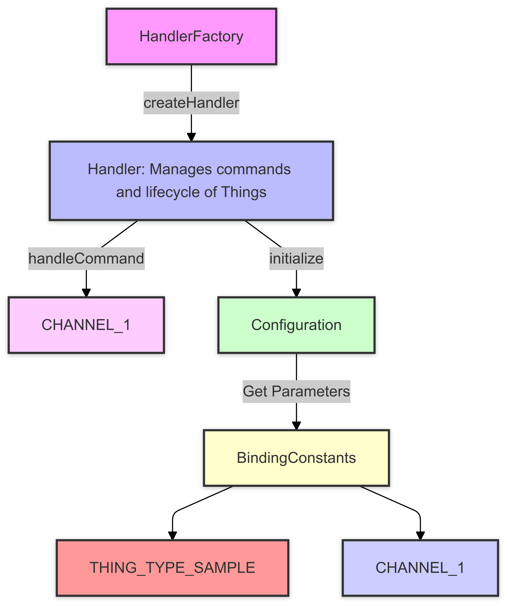

# Impact Analysis for Binding Module

## Purpose
This document analyzes the interactions between key components in the OpenHAB binding module using a call graph. It identifies critical components and highlights potential risks and dependencies that developers should consider when modifying the code.

## Call Graph Description
The following call graph illustrates the interaction between major components in the binding module:

1. **HandlerFactory**
   - Responsible for creating instances of `Handler` based on the Thing Type UID.
2. **Handler**
   - Manages the lifecycle of Things and processes commands sent to channels.
3. **Configuration**
   - Provides configuration parameters such as `hostname`, `password`, and `refreshInterval`.
4. **BindingConstants**
   - Defines reusable constants like `THING_TYPE_SAMPLE` and `CHANNEL_1`.

### Call Graph
Below is the call graph generated for the binding module:

*Figure 1: Call Graph showing the interactions between `HandlerFactory`, `Handler`, `Configuration`, and `BindingConstants`.*

## Impact Analysis

### Critical Components
1. **Handler**
   - Central component that interacts with `Configuration` and `BindingConstants`.
   - Errors in command handling or lifecycle management can cause Things to malfunction.
2. **BindingConstants**
   - Updating constants like `CHANNEL_1` requires all references to be updated.
3. **Configuration**
   - Incorrect parameters such as `hostname` can lead to Things being offline.

### Potential Risks and Recommendations
#### Risks
- Changing `Handler` methods without testing can lead to runtime issues.
- Modifying `BindingConstants` without updating all references can break functionality.
- Configuration errors can prevent Things from initializing correctly.

#### Recommendations
- Write unit tests for all critical methods in `Handler`.
- Use backward-compatible updates for `BindingConstants`.
- Validate configuration fields during initialization.

## Summary
The call graph provides insights into the critical components and their dependencies in the binding module. By identifying potential risks and recommending mitigations, this analysis ensures that changes to the codebase are managed effectively, minimizing disruptions and improving maintainability.

